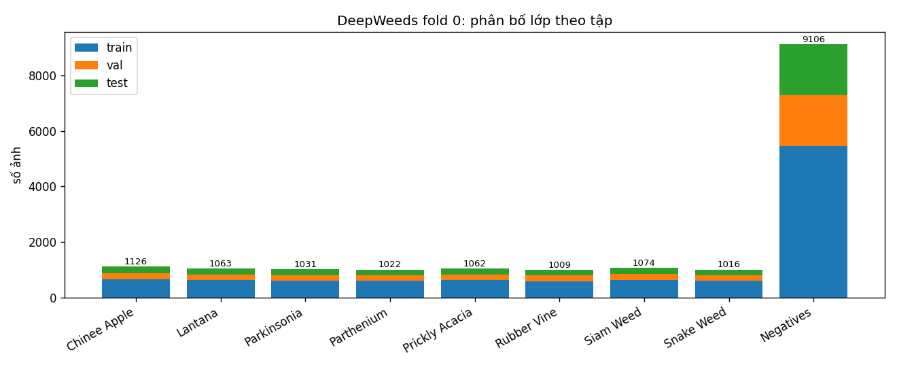
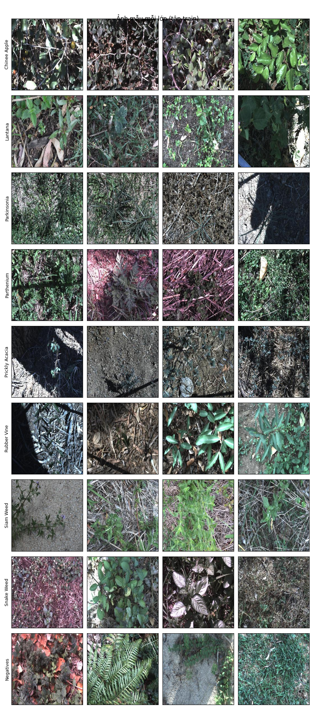
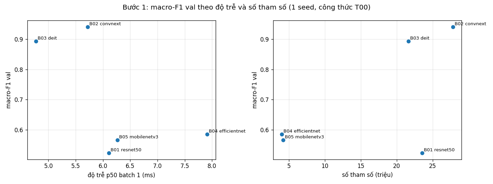
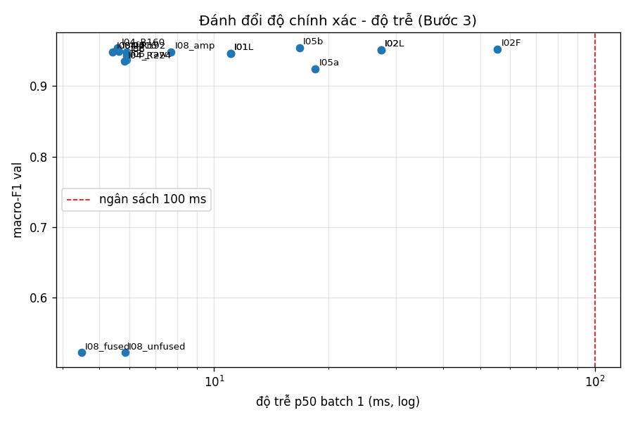
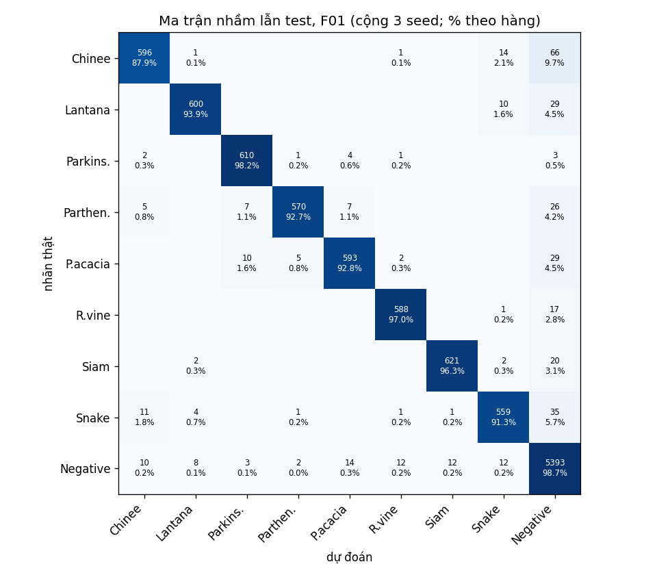
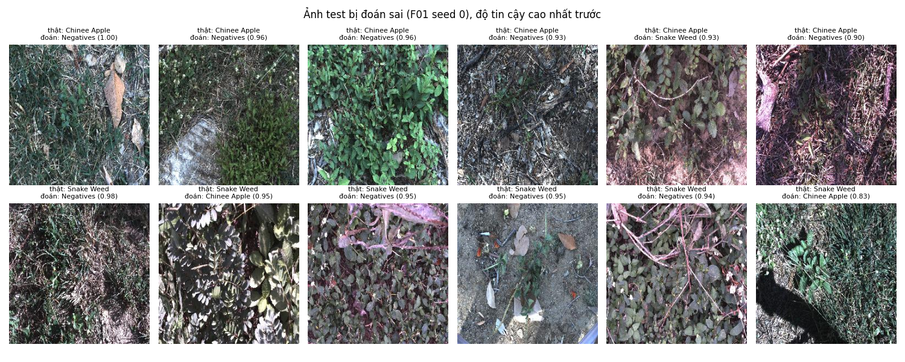
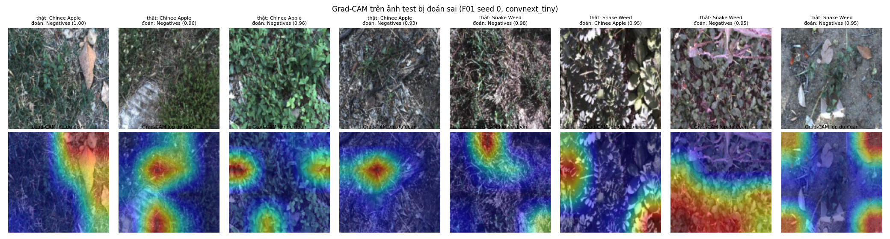

# Báo cáo Lab Day 2: Backbone, công thức huấn luyện và suy luận trên DeepWeeds

Nguyễn Đăng Thực, MHV 2A202603014

Số liệu trong báo cáo lấy từ `results.xlsx`, `eval_results/` (đầu ra nguyên bản của `eval.py`) và `logs/`. Mỗi con số có `exp_id` đi kèm để tra lại.

## 1. Tóm tắt

Bài toán là phân loại 9 lớp ảnh cỏ dại DeepWeeds, dùng fold 0 chia sẵn của tác giả. Em so sánh 5 backbone (ResNet-50, ConvNeXt-T, DeiT-S, EfficientNet-B0, MobileNetV3-L) với cùng một công thức nền. ConvNeXt-T tốt nhất trên val nên được chọn để làm 6 ablation công thức huấn luyện (4 trục A, B, C, F) và 1 thí nghiệm kết hợp, sau đó thử 9 nhóm cách suy luận và đo độ trễ trên GPU T4. Vì ngân sách GPU (cả notebook khoảng 30 phút), em train ở 128×128 trong 4 epoch.

Cấu hình cuối F01 gồm ConvNeXt-T, TrivialAugment, suy luận ở độ phân giải 160 và temperature scaling. Trên test, sau 3 seed:

- macro-F1 **0,9539 ± 0,0040**
- top-1 **0,9628 ± 0,0022**
- ECE 0,0053 ± 0,0003
- recall Chinee apple 0,879, recall Snake weed 0,913

Mốc T00 + I00 (công thức nền, 1 view) đạt macro-F1 0,9520 ± 0,0051 và top-1 0,9628 ± 0,0031. Chênh lệch macro-F1 là +0,0019, nhỏ hơn std nên **không phân biệt được** hai cấu hình trên test. Yếu tố ảnh hưởng lớn nhất trong bài là chọn backbone (macro-F1 val từ 0,52 đến 0,94); công thức huấn luyện và cách suy luận chỉ thay đổi khoảng 0,005 đến 0,007, cỡ một đến hai lần nhiễu seed.

## 2. Dữ liệu và thiết lập

### 2.1 Kiểm tra split (README mục 2.1)

Ba file `train_subset0.csv`, `val_subset0.csv`, `test_subset0.csv` tải nguyên bản từ GitHub tác giả, không sửa. Ảnh từ Zenodo, MD5 khớp `b7b30f96…`. Kết quả `check_split` (`logs/split_check.json`):

| Tập | Số ảnh | Tỉ lệ |
|---|---|---|
| train | 10.501 | 59,97% |
| val | 3.501 | 20,00% |
| test | 3.507 | 20,03% |

- train∩val = train∩test = val∩test = 0.
- Hợp ba tập đúng 17.509 ảnh, không thiếu file nào trên đĩa.
- Tỉ lệ lệch khỏi 60/20/20 dưới 0,05 điểm phần trăm, nên không cần báo giảng viên.

### 2.2 EDA

Số ảnh mỗi lớp đếm được khớp Table 1 của bài báo, trừ hai lớp lệch 1 ảnh: Chinee apple 1.126 (bài báo 1.125) và Lantana 1.063 (bài báo 1.064). Lớp Negatives có 9.106 ảnh, chiếm 52%. Lớp ít nhất là Rubber vine với 1.009 ảnh, nên tỉ lệ lớn nhất/nhỏ nhất là 9,02. Vì mất cân bằng như vậy, một mô hình đoán toàn Negatives vẫn đạt top-1 khoảng 52%. Do đó chỉ số chính là macro-F1.

Nhận xét khi xem ảnh mẫu:

- Toàn bộ 17.509 ảnh đều là RGB 256×256. Em dùng mean/std ImageNet theo cấu hình trọng số của timm, cả 5 backbone đều dùng (0,485, 0,456, 0,406)/(0,229, 0,224, 0,225).
- Lớp Negatives rất đa dạng: cỏ, dương xỉ, lá khô, đất trống, nhiều ảnh có cây lá rộng. Vì vậy ranh giới giữa Negatives và các loài cỏ dại không rõ.
- Chinee apple và Snake weed đều có lá nhỏ hình bầu dục, mọc sát đất, và nhiều ảnh bị bóng đổ hoặc ánh sáng gắt. Bằng mắt thường em thấy đây là cặp dễ nhầm nhất.
- Ảnh chụp từ trên xuống nên không có chiều "trên/dưới" cố định, lật ngang hợp lệ. Lật dọc về nguyên tắc cũng hợp lệ nhưng em chưa thử.

### 2.3 Kiểm tra pipeline (`logs/pipeline_checks.json`, notebook phần 0.3)

| Kiểm tra | Kết quả |
|---|---|
| Loss CE ban đầu, head mới, chưa train | ResNet-50: 2,187; DeiT-S: 2,276; ConvNeXt-T: 2,522 (kỳ vọng ln 9 = 2,197) |
| Overfit 32 ảnh cố định, 100 bước | loss 2,188 → 0,0020; accuracy ở eval mode 100% |
| Ảnh sau augmentation, đã giải chuẩn hoá, kèm nhãn | `figures/check_aug_basic.png`, `figures/check_aug_trivial.png`: ảnh và nhãn khớp |
| train/eval mode | `set_train_mode` bật train; `evaluate` đưa mọi module về eval; khi đóng băng thì BN backbone vẫn ở eval |
| Test tự viết `test_own.py` | 16/16 qua: focal γ=0 bằng CE (sai số < 1e-6), LS ε=0 bằng CE và khớp PyTorch, CutMix trộn cả ảnh lẫn nhãn với lam đúng diện tích thật, 3 nhóm tham số, lịch LR, gộp BN sai số < 1e-5, T tìm lại được, `parse_overrides` |
| Test của repo | 38/38 qua (`logs/test_repo.txt`) |

Loss ban đầu của ConvNeXt-T cao hơn ln 9 khoảng 0,3. Lý do là logit ban đầu có std 0,78 (của ResNet-50 chỉ 0,07), vì head ConvNeXt của timm có LayerNorm trước lớp fc nên đặc trưng đầu vào head đã được chuẩn hoá và có độ lớn lớn hơn. Mức này vẫn hợp lý và mô hình học bình thường. Seed được cố định cho random, numpy, torch và worker DataLoader. Em để `cudnn.benchmark=True` để chạy nhanh. Dù vậy, F01 seed 0 (Bước 4) cho lại đúng từng số của T02 seed 0 (cùng cấu hình, cùng seed): macro-F1 val qua 4 epoch là 0,8289 / 0,8904 / 0,9484 / 0,9462 ở cả hai lần.

### 2.4 Công thức nền T00 và phần giảm do ngân sách

Theo GUIDE mục 1.4: AdamW, LR backbone 1e-4 và head 1e-3, weight decay 0,05 (không áp cho norm, bias, pos-embed), warmup tuyến tính rồi cosine về 0 cập nhật theo từng bước, CE, AMP, chọn checkpoint theo macro-F1 val (hoà thì lấy epoch sớm hơn). Train dùng RandomResizedCrop + lật ngang; val/test dùng resize rồi center crop.

Để cả notebook chạy trong khoảng 30 phút trên một T4, em giảm theo thứ tự gợi ý ở GUIDE mục 7:

- độ phân giải train 128 (val/test: resize 146, crop 128)
- 4 epoch, batch 128, warmup 0,5 epoch (tổng 328 bước)
- ablation chỉ trên 1 backbone, 1 seed
- 5 backbone thay vì 6 (bỏ Swin-T)

DeiT-S dùng trọng số 224 và để timm nội suy pos-embed về lưới 8×8. Mọi backbone dùng chung công thức này.

Phần cứng và thư viện: Kaggle, Tesla T4, Python 3.13.15, torch 2.11.0+cu128, torchvision 0.26.0, timm 1.0.29, pandas 2.3.3. GMAC đếm bằng fvcore ở 128×128.

## 3. So sánh backbone (sheet `Backbones`)

| exp_id | backbone (tag) | #tham số (M) | GMAC @128 | macro-F1 val | top-1 val | s/epoch | p50 / p95 b1 (ms) | ảnh/s b32 |
|---|---|---|---|---|---|---|---|---|
| B01 | resnet50.a1_in1k | 23,5 | 1,34 | 0,5226 | 0,6778 | 13,4 | 6,11 / 6,60 | 829 |
| B02 | convnext_tiny.in12k_ft_in1k | 27,8 | 1,46 | **0,9412** | **0,9554** | 23,6 | 5,72 / 6,06 | 625 |
| B03 | deit_small_patch16_224.fb_in1k | 21,6 | 1,40 | 0,8934 | 0,9212 | 11,8 | 4,77 / 5,22 | 772 |
| B04 | efficientnet_b0.ra_in1k | 4,0 | 0,13 | 0,5851 | 0,6895 | 20,4 | 7,91 / 11,10 | 2.535 |
| B05 | mobilenetv3_large_100.ra_in1k | 4,2 | 0,08 | 0,5656 | 0,6815 | 15,4 | 6,27 / 6,60 | 4.554 |

Một seed (seed 0) cho mọi backbone. Thời gian/epoch là trung bình 4 epoch và gồm cả epoch đầu (lần đầu cuDNN dò thuật toán), nên B04 và B05 bị đội lên. Ví dụ B04 có epoch đầu 52 s, các epoch sau 10 s.

Nhận xét:

- **Hai nhóm tách hẳn nhau.** ConvNeXt-T và DeiT-S đạt macro-F1 val 0,89–0,94. Ba mạng CNN dùng BatchNorm (ResNet-50, EfficientNet-B0, MobileNetV3) chỉ đạt 0,52–0,59. Đường cong `curves/B01_resnet50.png`, `B04_*`, `B05_*` cho thấy loss train vẫn khoảng 1,0 ở epoch 4 và accuracy train thấp hơn val, tức là **chưa học xong (underfit)**, không phải quá khớp. Không backbone nào có dấu hiệu quá khớp trong 4 epoch: loss val giảm đều theo loss train.
- **Giả thuyết cho nhóm kém (chưa kiểm chứng):** chỉ có 328 bước với LR backbone 1e-4. Ngoài ra, trọng số `resnet50.a1_in1k` được huấn luyện bằng BCE với công thức rất mạnh, còn ConvNeXt dùng trọng số tiền huấn luyện trên ImageNet-12k. Kết quả này gắn với ngân sách ngắn và không nói ResNet-50 kém trên DeepWeeds: bài báo gốc đạt 95,7% với ResNet-50 sau khoảng 100 epoch (trích dẫn). Muốn kết luận về kiến trúc thì phải chạy lâu hơn hoặc dùng LR cao hơn cho nhóm CNN-BN.
- **Thứ hạng khác ImageNet.** Khoảng cách giữa hai nhóm ở đây (khoảng 0,4 điểm macro-F1) lớn hơn nhiều so với chênh lệch giữa các mạng này trên ImageNet. Vì vậy thứ hạng trong bảng chủ yếu phản ánh tốc độ hội tụ khi tinh chỉnh ngắn và nguồn trọng số, không phản ánh thứ hạng ImageNet.
- **FLOPs không dự đoán được độ trễ batch 1.** MobileNetV3 có 0,075 GMAC (ít hơn ConvNeXt-T gần 20 lần) nhưng p50 batch 1 là 6,27 ms, chậm hơn ConvNeXt-T (5,72 ms). Ở batch 1 trên T4, thời gian bị chi phối bởi số lần gọi kernel chứ không phải số phép tính. Ở batch 32 thì thông lượng mới xếp gần theo FLOPs: MobileNetV3 4.554 ảnh/s, ConvNeXt-T 625 ảnh/s. Thời gian train/epoch cũng không theo FLOPs vì phần đọc ảnh và augmentation trên CPU chiếm đáng kể với các mạng nhẹ.

**Chọn đi tiếp: ConvNeXt-T (B02).** Macro-F1 val cao nhất (0,9412), hơn DeiT-S 0,048, lớn hơn rất nhiều so với std nhiễu seed đo ở Bước 2 (0,0037). Ở đây không có đánh đổi buộc phải chọn mạng nhẹ: p95 batch 1 của ConvNeXt-T là 6,06 ms, nằm trong cùng khoảng với hai mạng nhẹ (6,60 và 11,10 ms) và thấp hơn rất nhiều so với ngân sách 100 ms. Mạng nhẹ chỉ có lợi khi chạy batch lớn hoặc trên phần cứng yếu hơn T4. Cả bài chỉ đủ thời gian cho một backbone ở Bước 2.

## 4. Công thức huấn luyện (sheet `Training`)

Backbone cố định là ConvNeXt-T, seed 0, mỗi lần chạy chỉ khác T00 một yếu tố. **Nhiễu seed** đo bằng T00 với 3 seed: macro-F1 val lần lượt 0,9412 / 0,9486 / 0,9446, std = **0,0037**. T00 seed 0 chính là B02 (cùng cấu hình, chỉ khác tên), em chép lại thay vì train lần nữa (`logs/run_logs/T00/seed0/config.json` có trường `copied_from`).

| exp_id | trục | khác T00 | macro-F1 val | Δ so với T00 | so với std 0,0037 | F1 Chinee | F1 Snake | F1 Negatives |
|---|---|---|---|---|---|---|---|---|
| T00 | – | công thức nền (seed 0) | 0,9412 | – | – | 0,871 | 0,891 | 0,972 |
| T01 | A | đóng băng backbone, chỉ train head | 0,7476 | −0,1936 | kém rõ | 0,667 | 0,657 | 0,862 |
| T02 | B | + TrivialAugmentWide | **0,9484** | +0,0072 | vượt (≈1,9 std) | 0,924 | 0,884 | 0,972 |
| T03 | B | CutMix α=1 | 0,9443 | +0,0031 | không phân biệt được | 0,883 | 0,894 | 0,973 |
| T04 | C | label smoothing ε=0,1 | 0,9459 | +0,0047 | vượt nhẹ (≈1,3 std) | 0,887 | 0,895 | 0,972 |
| T05 | C | CE trọng số 1/n_c | 0,9327 | −0,0085 | kém rõ | 0,866 | 0,881 | 0,962 |
| T06 | F | EMA decay 0,99 | 0,9433 | +0,0020 | không phân biệt được | 0,885 | 0,903 | 0,971 |
| T07 | kết hợp | T02 + T04 | 0,9453 | +0,0041 | vượt nhẹ | 0,886 | 0,891 | 0,972 |

Nhận xét theo từng trục:

- **Khởi tạo (A).** Đóng băng backbone chỉ đạt 0,748: đặc trưng ImageNet chưa đủ để phân biệt các loài cỏ, phải tinh chỉnh toàn bộ. Bù lại train nhanh gấp khoảng 2,6 lần (7,3 so với 18,8 s/epoch). Em không chạy "train từ đầu" vì với 4 epoch kết quả gần như chắc chắn rất thấp, và ngân sách không đủ.
- **Augmentation (B).** TrivialAugment tăng 0,0072 và là yếu tố duy nhất vượt rõ nhiễu. Có một điểm cần thận trọng: Δ này bằng đúng chênh lệch giữa T00 seed 1 và T00 seed 0 (+0,0074). Nếu so với **trung bình** T00 (0,9448) thì T02 chỉ hơn 0,0036, khoảng 1 std. Bằng chứng vì vậy còn yếu, cần thêm seed. CutMix cho Δ trong nhiễu. Loss train của CutMix vẫn cao (0,67 ở epoch 4, `curves/T03_cutmix.png`), nên có thể 4 epoch là quá ngắn để CutMix phát huy. Cũng có thể hộp cắt dán che mất phần cây nhỏ khiến nhãn trộn không còn đúng.
- **Loss (C).** Label smoothing tăng nhẹ (+0,0047). CE có trọng số 1/n_c lại **giảm** 0,0085: F1 Negatives giảm từ 0,972 xuống 0,962 (mô hình đẩy nhiều ảnh Negatives sang các loài), trong khi F1 hai lớp khó không tăng (Chinee 0,871 → 0,866). Với dữ liệu này, cân bằng lại loss không giúp lớp hiếm mà chỉ chuyển lỗi sang lớp Negatives.
- **EMA (F).** So với T00, Δ +0,0020 nằm trong nhiễu. Nhưng trong cùng lần chạy T06, trọng số EMA hơn trọng số thường ở cùng epoch 0,0064 (0,9433 so với 0,9369, xem I06 ở mục 5) và ECE thấp hơn (0,0063 so với 0,0093). EMA không tốn thêm chi phí suy luận, nên nếu chạy dài hơn em vẫn sẽ bật.
- **Kết hợp.** Em dùng cách tham lam theo trục: mỗi trục lấy biến thể tốt nhất có Δ > std, được T02 (B) và T04 (C). T07 = TrivialAugment + label smoothing cho 0,9453, **thấp hơn T02 đứng một mình** 0,0031 (trong nhiễu). Hai hiệu ứng không cộng dồn. Một cách giải thích là cả hai đều làm mô hình bớt tự tin hơn, nên với 4 epoch gộp lại có thể thành điều chuẩn hoá quá mức. Thứ tự xét trục có thể ảnh hưởng kết quả của cách tham lam này.

Công thức mang sang Bước 3 là **T02** (macro-F1 val cao nhất trong các lần chạy seed 0).

## 5. Suy luận và độ trễ (sheet `Inference`, `Latency`)

Mô hình là T02 seed 0, không train lại; mọi số đều trên val. Độ trễ đo trên Tesla T4, torch 2.11:

- warmup 10 lần rồi bỏ
- `torch.cuda.synchronize()` ngay trước và ngay sau đoạn đo
- 60 lần đo, báo p50/p95/p99
- đầu vào là tensor đã nằm trên GPU, không tính tiền xử lý (có một dòng riêng tính cả tiền xử lý)

| exp_id | phương pháp | K | macro-F1 val | top-1 val | ECE val | p50 / p95 b1 (ms) | ảnh/s b32 | chi phí so với I00 |
|---|---|---|---|---|---|---|---|---|
| I00 | 1 view, crop 128 | 1 | 0,9481 | 0,9589 | 0,0125 | 5,90 / 6,39 | 636 | 1,00 |
| I01 | TTA lật ngang, gộp xác suất | 2 | 0,9460 | 0,9583 | 0,0143 | 11,07 / 12,24 | 298 | 1,88 |
| I01L | TTA lật ngang, gộp logit | 2 | 0,9460 | 0,9583 | 0,0132 | như I01 | 298 | 1,88 |
| I02 | 5 crop, gộp xác suất | 5 | 0,9509 | 0,9614 | 0,0195 | 27,46 / 28,57 | 126 | 4,66 |
| I02L | 5 crop, gộp logit | 5 | 0,9509 | 0,9614 | 0,0132 | như I02 | 126 | 4,66 |
| I02F | 10 crop (5 crop + lật) | 10 | 0,9527 | 0,9634 | 0,0236 | 55,56 / 59,38 | 63 | 9,42 |
| I04_R160 | độ phân giải kiểm tra 160 | 1 | **0,9545** | 0,9640 | 0,0120 | 5,58 / 5,95 | 410 | 0,95 |
| I04_R192 | độ phân giải 192 | 1 | 0,9494 | 0,9589 | 0,0132 | 5,61 / 5,94 | 280 | 0,95 |
| I04_R224 | độ phân giải 224 | 1 | 0,9351 | 0,9463 | 0,0101 | 5,82 / 6,07 | 206 | 0,99 |
| I05a | ensemble B02 + B03 + B04 | 3 | 0,9240 | 0,9426 | 0,1025 | 18,45 / 19,70 | 306 | 3,13 |
| I05b | ensemble T00 ba seed | 3 | 0,9540 | 0,9646 | 0,0095 | 16,74 / 17,55 | 210 | 2,84 |
| I06 | trọng số EMA (T06) | 1 | 0,9433 | 0,9560 | 0,0063 | như I00 | – | 1,00 |
| I06_raw | trọng số thường, cùng epoch (T06) | 1 | 0,9369 | 0,9509 | 0,0093 | như I00 | – | 1,00 |
| I07 | I00 + temperature scaling (T = 0,915) | 1 | 0,9481 | 0,9589 | 0,0071 | như I00 | – | 1,00 |
| I08_fp16 | FP16 (`model.half()`) | 1 | 0,9481 | 0,9589 | 0,0124 | 5,42 / 5,86 | 2.220 | 0,92 |
| I08_amp | AMP autocast | 1 | 0,9484 | 0,9592 | 0,0127 | 7,71 / 8,04 | 1.743 | 1,31 |
| I08_fused | gộp BN, trên B01 ResNet-50 | 1 | 0,5224 (= chưa gộp) | 0,6775 | 0,0514 | 4,49 / 4,69 (chưa gộp 5,84 / 6,38) | 837 (chưa gộp 791) | 0,76 |

Nhận xét theo phương pháp:

- **TTA.** Lật ngang giảm 0,0021 mà tốn gần gấp đôi thời gian. 5 crop tăng 0,0028, 10 crop tăng 0,0046 nhưng tốn 4,7 và 9,4 lần (p95 59 ms). Các mức tăng này đều cỡ hoặc nhỏ hơn std seed, và được đo trên một mô hình nên chỉ là so sánh cặp. Ở batch 1, nếu gộp K view thành một batch thì chi phí giảm hẳn: 5 crop chỉ còn p50 7,99 ms thay vì 27,46 ms khi chạy tuần tự, vì GPU còn rảnh. Ở batch 32, gộp view gần như không lợi (242,7 so với 253,4 ms), chi phí khi đó gần tuyến tính theo K như slide nói.
- **Gộp xác suất hay gộp logit.** Macro-F1 bằng nhau ở cả lật ngang và 5 crop, nhưng gộp logit cho ECE thấp hơn (5 crop: 0,0132 so với 0,0195). Trung bình xác suất làm phân phối "tù" hơn và mô hình trở nên thiếu tự tin. Nếu dùng TTA em sẽ chọn gộp logit.
- **Độ phân giải kiểm tra (FixRes).** Test ở 160 trong khi train ở 128 cho kết quả tốt nhất (+0,0064). Độ trễ batch 1 không tăng (5,58 ms) vì GPU vẫn chưa dùng hết, chỉ thông lượng batch 32 giảm từ 636 xuống 410 ảnh/s. Lên 224 thì giảm mạnh (0,9351). Lý do: RandomResizedCrop lúc train phóng to vật thể, nên khi test tăng độ phân giải vừa phải thì kích thước biểu kiến của lá khớp với lúc train hơn; tăng quá nhiều thì lệch theo chiều ngược lại.
- **Ensemble.** Gộp 3 backbone khác nhau lại **kém hơn** ConvNeXt-T đứng một mình (0,9240), vì hai thành viên yếu hơn nhiều và ECE tăng lên 0,10. Gộp 3 seed T00 đạt 0,9540, ngang R160, nhưng tốn 2,8 lần.
- **Temperature scaling.** T = 0,915 nhỏ hơn 1, tức mô hình hơi **thiếu tự tin** (do 4 epoch ngắn và augmentation). ECE val giảm từ 0,0125 xuống 0,0071. Vì T khớp và đo trên cùng tập val nên con số này lạc quan. Khi khớp trên một nửa val và đo trên nửa còn lại, ECE là 0,0100, vẫn giảm. Accuracy không đổi. Reliability diagram ở `figures/reliability_val.png`.
- **FP16 và AMP.** FP16 giữ nguyên macro-F1, nhanh hơn một chút ở batch 1 (5,42 so với 5,90 ms) và nhanh gấp 3,5 lần ở batch 32. **AMP ở batch 1 lại chậm hơn FP32** (7,71 so với 5,90 ms) vì tốn thêm thao tác ép kiểu, đúng như slide trang 73 cảnh báo. Ở batch 32 thì AMP nhanh gấp 2,7 lần.
- **Gộp BN.** ConvNeXt-T dùng LayerNorm nên không gộp BN được. Em làm trên B01 ResNet-50: gộp 53 cặp conv-BN, sai số đầu ra lớn nhất 1,6e-5, macro-F1 không đổi (0,5224), p50 batch 1 giảm 23% (5,84 → 4,49 ms).
- **Tiền xử lý.** Tính cả đọc JPEG, transform và chép lên GPU thì I00 là p50 7,92 ms, p95 8,83 ms, tức thêm khoảng 2 ms.

Dữ liệu ủng hộ nhận định của slide. Những thứ không tốn thêm chi phí (độ phân giải đã dò, EMA, FP16, gộp BN) cho lợi ích ngang hoặc hơn TTA/ensemble, trong khi TTA và ensemble tốn 2–9 lần mà chỉ tăng trong cỡ nhiễu. TTA và ensemble hợp với xử lý ngoại tuyến; trên robot nên dùng độ phân giải đã dò kèm FP16.

**Chọn cho chung kết:** R160, vì đây là cách một mô hình có macro-F1 val cao nhất (Δ +0,0064 so với I00) và p95 batch 1 là 5,95 ms. Sau đó em áp temperature scaling với T khớp trên val của từng seed.

## 6. Cấu hình tốt nhất và chung kết (sheet `Final`, `PerClass`)

**F01** gồm:

- ConvNeXt-T (`convnext_tiny.in12k_ft_in1k`) tinh chỉnh toàn bộ, AdamW, LR 1e-4/1e-3, wd 0,05 (không áp cho norm/bias), warmup 0,5 epoch + cosine, batch 128, 4 epoch, AMP, CE
- train: RandomResizedCrop 128 + lật ngang + TrivialAugmentWide
- suy luận: resize 183 + center crop 160, FP32
- temperature scaling với T khớp trên val (T = 0,866 / 0,968 / 1,053 cho seed 0/1/2)

Mốc là T00 + I00: dùng lại checkpoint T00 seed 0/1/2 của Bước 2 (đã chọn trên val), suy luận 1 view ở 128.

Test chỉ chạy **một lần cho mỗi seed**, sau khi mọi lựa chọn đã chốt trên val (`logs/decisions.json`). Hàm ghi file dự đoán sẽ báo lỗi nếu file test của seed đó đã tồn tại.

| Cấu hình | macro-F1 val | macro-F1 test | top-1 test | balanced acc test | ECE test |
|---|---|---|---|---|---|
| F01 (3 seed) | 0,9510 ± 0,0040 | **0,9539 ± 0,0040** | **0,9628 ± 0,0022** | 0,9431 ± 0,0081 | 0,0053 ± 0,0003 |
| F01 chưa TS (`F01_uncal`) | – | 0,9539 ± 0,0040 | 0,9628 ± 0,0022 | 0,9431 ± 0,0081 | 0,0069 ± 0,0022 |
| Mốc T00 + I00 (3 seed) | 0,9448 ± 0,0037 | 0,9520 ± 0,0051 | 0,9628 ± 0,0031 | 0,9471 ± 0,0062 | 0,0068 ± 0,0004 |

Tất cả số trên khớp với `eval_results/F01_summary.json`, `T00_summary.json` và `F01_uncal_summary.json` do `eval.py score` tạo ra. Kết quả `eval.py grade` (`eval_results/grade.txt`, đề xuất):

| Mục | Điểm | Chi tiết |
|---|---|---|
| I1 | 7/7 | top-1 96,28% |
| I2 | 2/5 | Δ = +0,0019 ≤ s = 0,0051 |
| I3 | 3/4 | Chinee 87,9%, Snake 91,3% |
| I4a | 1/1 | ECE 0,0069 → 0,0053 |
| I4b | 1/1 | chênh val/test 0,0029 |
| I5 | 2/2 | p95 6,0 ms |
| **Tổng** | **16/20** | |

Hai lớp khó, F01 trên test (mean ± std 3 seed):

| Lớp | Precision | Recall | F1 | Mốc T00: recall | Bài báo (trích dẫn) |
|---|---|---|---|---|---|
| Chinee apple (226 ảnh) | 0,955 ± 0,005 | 0,879 ± 0,014 | 0,915 ± 0,008 | 0,900 ± 0,028 | 88,5% |
| Snake weed (204 ảnh) | 0,936 ± 0,023 | 0,913 ± 0,028 | 0,924 ± 0,009 | 0,904 ± 0,031 | 88,8% |

Trên val, F01 hơn mốc 0,0062, nhưng trên test chỉ còn 0,0019, nhỏ hơn std. Em hiểu là phần lớn lợi thế trên val đến từ việc chọn cấu hình tốt nhất trong nhiều lựa chọn trên chính tập val (thắng nhờ may khi chọn). Kết luận trung thực là **chung kết và mốc không phân biệt được trên test**. Riêng temperature scaling cải thiện được thật (ECE 0,0069 → 0,0053, độ lệch giữa các seed nhỏ hơn) và không đổi accuracy.

**Phân tích lỗi** (ma trận cộng 3 seed của F01, `eval_results/F01_confusion_sum.csv`):

- **Lỗi lớn nhất là các loài cỏ bị đoán thành Negatives.** Chinee apple → Negatives 66 lần trên 678 (9,7%); Snake weed → Negatives 35/612 (5,7%); Prickly acacia, Lantana, Parthenium → Negatives lần lượt 29, 29, 26 lần.
- **Nhầm Chinee apple ↔ Snake weed:** 14/678 (2,1%) Chinee bị đoán thành Snake, và 11/612 (1,8%) ngược lại. Tỉ lệ thấp hơn bài báo (3,4% và 4,1%, trích dẫn), nhưng đây vẫn là cặp nhầm nhiều nhất giữa hai loài.
- **Negatives** bị đoán sai rải ra nhiều loài: nhiều nhất là Prickly acacia (14 lần), Rubber vine, Siam weed và Snake weed (mỗi loài 12 lần), ít nhất là Parthenium (2 lần).

Khi xem các ảnh bị đoán sai với độ tin cậy cao nhất và Grad-CAM của lớp dự đoán, em có ba giả thuyết:

1. **Cây mục tiêu chỉ chiếm phần nhỏ của ảnh.** Nhiều ảnh Chinee apple bị đoán Negatives với độ tin cậy 0,93–1,00, phần lớn ảnh là cỏ, lá khô, đất, còn cây mục tiêu nhỏ hoặc bị che. Nhãn gán cho cả ảnh, nên mô hình học bối cảnh nhiều hơn.
2. **Mô hình nhìn vào nền thay vì cây.** Grad-CAM của các ảnh này thường sáng ở lá khô hoặc vùng nền (ví dụ ảnh đầu tiên sáng ở chiếc lá khô lớn).
3. **Bóng đổ, ánh sáng gắt và độ phân giải thấp.** Các ảnh Snake weed ↔ Chinee apple bị nhầm đều có lá bầu dục nhỏ và bóng đổ mạnh. Ở 128 px, chi tiết mép lá và gân lá (thứ phân biệt hai loài) bị mất nhiều.

## 7. Kết luận và khuyến nghị

- **Cấu hình tốt nhất** là F01 (ConvNeXt-T + TrivialAugment + test 160 + TS): macro-F1 test 0,9539 ± 0,0040, top-1 0,9628 ± 0,0022. So với mốc T00 + I00, Δ macro-F1 = +0,0019 nhỏ hơn std (0,0051), nên **không vượt nhiễu**. Cải thiện rõ duy nhất trên test là hiệu chuẩn (ECE giảm khoảng 23%).
- **Yếu tố đóng góp nhiều nhất là backbone** (cùng công thức, macro-F1 val từ 0,52 đến 0,94), kèm theo việc phải tinh chỉnh toàn bộ thay vì đóng băng (−0,19). Công thức huấn luyện (tốt nhất +0,0072) và cách suy luận (tốt nhất +0,0064) chỉ thay đổi cỡ 1–2 lần nhiễu seed. Với ngân sách 4 epoch, chọn đúng trọng số tiền huấn luyện quan trọng hơn nhiều so với tinh chỉnh công thức.
- **Triển khai trên robot với ngân sách 30–100 ms/khung:** em chọn **F01 một mô hình ở 160, FP32 hoặc FP16, không TTA**. Trên T4, p95 batch 1 là 5,95 ms, cộng tiền xử lý khoảng 2 ms, vẫn thấp hơn ngân sách hơn 10 lần, và ECE thấp nhờ TS. Không nên dùng TTA 10 crop (p95 59 ms, chỉ +0,0046 val trên một mô hình) hay ensemble (2,8–3,1 lần chi phí) vì lợi ích nằm trong nhiễu. Nếu phần cứng thật yếu hơn nhiều (ví dụ Jetson; em chưa đo), có thể tính đến MobileNetV3 khi chạy batch lớn, nhưng phải train lâu hơn vì với 4 epoch nó chỉ đạt 0,57.
- **Ngoại tuyến:** ensemble 3 seed hoặc 10 crop gộp logit chỉ đáng dùng khi không quan tâm thời gian, và cũng chưa chứng minh được là tốt hơn.

## 8. Hạn chế và việc tiếp theo

- **Giảm do ngân sách:** train 128 px, 4 epoch, batch 128 thay vì 224 px và 12 epoch. Các CNN dùng BN rõ ràng chưa hội tụ, nên thứ hạng backbone ở mục 3 chỉ đúng với ngân sách ngắn này. Đây cũng là lý do top-1 khó vượt nhiều so với mốc.
- **Ít seed:** mỗi ablation ở Bước 1–3 chỉ có 1 seed. Std nhiễu (0,0037) ước lượng từ 3 seed nên bản thân nó cũng không chắc. Chung kết chỉ có 3 seed.
- **Một fold, chia ngẫu nhiên:** chỉ dùng fold 0. Dữ liệu được chia ngẫu nhiên chứ không theo địa điểm chụp, nên ảnh cùng một địa điểm, cùng ánh sáng có thể nằm ở cả train và test, khiến điểm test có thể lạc quan so với khi robot gặp địa điểm mới.
- **Chọn trên val có thiên lệch:** lợi thế val của F01 (+0,0062) không giữ được trên test (+0,0019). Độ phân giải 160 cũng được chọn dựa trên một mô hình (T02 seed 0).
- **T00 seed 0 là bản chép của B02** (cùng cấu hình), không phải một lần chạy riêng. Notebook bị chia làm hai phần: phần 1 dừng vì lỗi hiển thị bảng sau Bước 1, phần 2 chạy tiếp từ output phần 1 mà không train lại B01–B05 (`code/lab_day2_executed_part1.ipynb`, `code/lab_day2_executed_part2.ipynb`).
- **Lệch phân phối** (phần làm thêm, sheet `Bonus_Shift`): em làm hỏng ảnh **val** và đo lại với F01 seed 0 ở 1 view.

  | Lệch phân phối | macro-F1 | ECE trước TS | ECE sau TS |
  |---|---|---|---|
  | sạch | 0,948 | 0,0125 | 0,0071 |
  | tối (độ sáng ×0,4) | 0,909 | 0,0151 | 0,0101 |
  | nhiễu Gaussian std 0,08 | 0,799 | 0,0498 | 0,0611 |
  | mờ Gaussian r = 2,5 | 0,443 | 0,1435 | 0,1652 |
  | JPEG chất lượng 10 | 0,391 | 0,1582 | 0,1803 |

  Mô hình chịu được ảnh tối nhưng sụp mạnh khi ảnh mờ hoặc nén mạnh: recall Snake weed còn 0,12 khi ảnh mờ. Temperature scaling khớp trên val sạch (T < 1 làm xác suất sắc hơn) còn làm ECE **tệ hơn** khi có nhiễu, mờ hoặc JPEG. Vì vậy T khớp trên val không đáng tin khi điều kiện chụp thay đổi (mùa khác, robot rung gây mờ, camera khác).
- **Độ trễ chỉ đo trên T4**, chưa đo trên thiết bị nhúng của robot. Em chưa xuất ONNX.
- **Việc tiếp theo:**
  - train 224 px, 12–15 epoch cho cả 5 backbone (nhất là nhóm CNN-BN), 3 seed cho các ablation có Δ gần std (T02, T04, T06)
  - thử lật dọc, xoay, và test-time adaptation (cập nhật thống kê/LayerNorm) cho trường hợp ảnh mờ
  - chạy thêm fold 1–4

## 9. Phụ lục

**Danh sách thí nghiệm** (cấu hình đầy đủ ở `logs/run_logs/<exp_id>/seed<k>/config.json`, log theo epoch ở `history.csv`, đường cong ở `curves/`):

| exp_id | Nội dung |
|---|---|
| B01–B05 | resnet50, convnext_tiny, deit_small_patch16_224, efficientnet_b0, mobilenetv3_large_100; công thức nền, seed 0 |
| T00 | convnext_tiny công thức nền, seed 0 (= B02), 1, 2 |
| T01 | init = frozen |
| T02 | aug = trivial |
| T03 | mix = cutmix |
| T04 | loss = ls, ε = 0,1 |
| T05 | loss = ce_weighted, β = 0 |
| T06 | ema_decay = 0,99 |
| T07 | aug = trivial + loss = ls |
| I00–I08 | các cách suy luận ở mục 5, trên mô hình T02 seed 0 (I06 dùng T06, I08_fused dùng B01) |
| F01 | công thức T02, seed 0/1/2, suy luận R160 + TS; mốc là T00 seed 0/1/2 + I00 |

**Các file liên quan:**

- Mọi lựa chọn và lý do: `logs/decisions.json`
- File dự đoán: `predictions/F01_seed{0,1,2}_test.csv`, `F01_uncal_seed{0,1,2}_test.csv`, `F01_seed{0,1,2}_val.csv`, `T00_seed{0,1,2}_test.csv` và file val của mọi lần chạy
- Notebook: xem `README.md`
